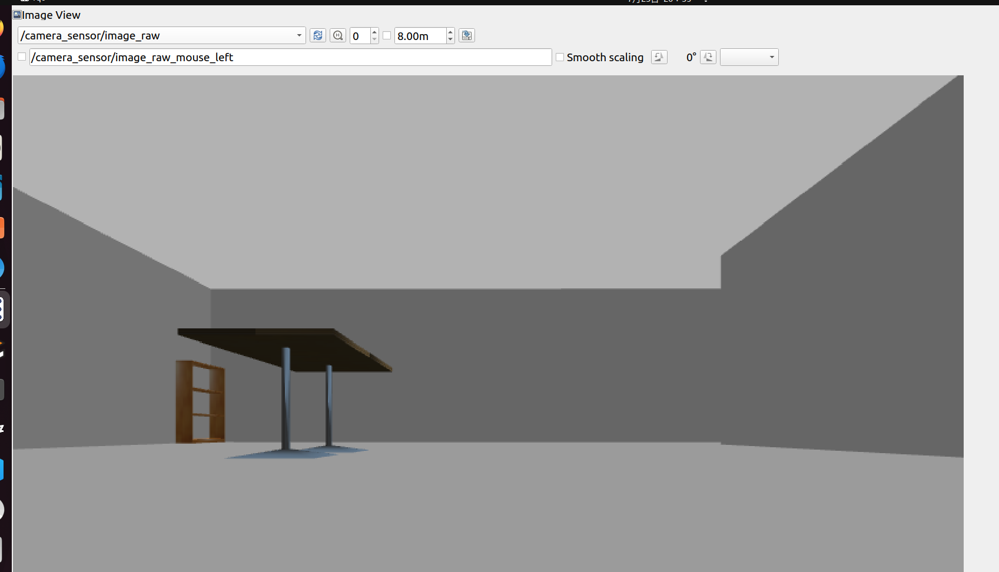

# 基于 ROS 2 和 Navigation 2 自动巡检机器人

## 1.项目介绍

本项目基于 ROS 2 和  Navigation 2 设计了一个自动巡检机器人仿真功能。

该巡检机器人要能够在不同的目标点之间进行循环移动，每到达一个目标点后首先通过语音播放到达的目标点信息，接着通过摄像头采集一张实时的图像并保存到本地。

各功能包功能如下：
- fishbot_description 机器人描述文件，包含仿真相关配置
- fishbot_navigation2 机器人导航配置文件
- fishbot_application 机器人导航应用 Python 代码
- fishbot_application_cpp 机器人导航应用 C++ 代码
- autopatrol_interfaces  自动巡检相关接口
- autopatrol_robot  自动巡检实现功能包

## 2.使用方法

本项目开发平台信息如下：

- 系统版本： Ubunt22.04
- ROS 版本：ROS 2 Humble

### 2.1安装

本项目建图采用 slam-toolbox，导航采用 Navigation 2 ,仿真采用 Gazebo，运动控制采用 ros2-control 实现，构建之前请先安装依赖，指令如下：

1. 安装 SLAM 和 Navigation 2

```
sudo apt install ros-$ROS_DISTRO-nav2-bringup ros-$ROS_DISTRO-slam-toolbox
```

2. 安装仿真相关功能包

```
sudo apt install ros-$ROS_DISTRO-robot-state-publisher  ros-$ROS_DISTRO-joint-state-publisher ros-$ROS_DISTRO-gazebo-ros-pkgs ros-$ROS_DISTRO-ros2-controllers ros-$ROS_DISTRO-xacro
```

3. 安装语音合成和图像相关功能包

```
sudo apt install python3-pip  -y
sudo apt install espeak-ng -y
sudo pip3 install espeakng
sudo apt install ros-$ROS_DISTRO-tf-transformations
sudo pip3 install transforms3d
```

### 2.2运行

安装完成依赖后，可以使用 colcon 工具进行构建和运行。

构建功能包

```
colcon build
```

运行仿真

```
source install/setup.bash
ros2 launch fishbot_description gazebo_sim.launch.py
```

运行导航

```
source install/setup.bash
ros2 launch fishbot_navigation2 navigation2.launch.py
```

运行自动巡检

```
source install/setup.bash
ros2 launch autopatrol_robot autopatrol.launch.py
```

## 3.成果展示
地图与机器人建模：

机器人拍照彩色图像信息：

